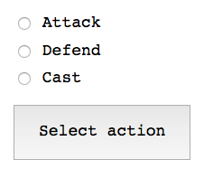
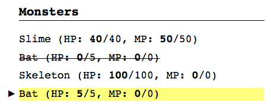

# Guía

_Nota: lee primero el [enunciado de la práctica](index.md) antes de leer este documento._

Esta es una guía paso a paso con sugerencias para afrontar la práctica. Es recomendable **leer este documento entero** –especialmente el apartado de _Consideraciones_– antes de ponerse a realizar el primer paso.

También es recomendable tener fresca en la cabeza la API de la práctica anterior de las batallas RPG con Node: repasa el enunciado de la práctica o su código fuente.

Durante el desarrollo de esta práctica, si te atascas sobre qué llamadas a la API hay que hacer, siempre puedes consultar el archivo `index.js` de la práctica anterior –donde hay programado un cliente de dicha API.

## 1. Mostrar los personajes

En el código HTML de base, hay dos listas `<ul class="character-list">` que hay que rellenar con elementos `<li>`, uno por personaje. Debemos indicar el nombre del personaje junto con sus atributos de vida y maná. Más adelante nos será util poder referinos a ese personaje, así que es conveniente almacenar en un atributo data su ID de personaje.


```html
<ul class="character-list">
    <!-- ... -->
    <li data-chara-id="bat 2">
        bat (HP: <strong>5</strong>/5, MP: <strong>0</strong>/0)
    </li>
</ul>
```

Aunque las listas `<ul>` están creadas en el archivo HTML, falta rellenar su contenido, lo cual se ha de hacer dinámicamente con JavaScript. Con `Battle.prototype.characters.allFrom` se puede acceder a las vistas (`CharactersView`) de los personajes de una party.

Como habrá que refrescar el contenido de estas listas, es recomendable implementar una función que haga esto, para poder llamarla más adelante desde otros sitios.

Por ahora, se puede comenzar con mostrar los personajes al inicio de cada turno. Para ello, hay que subscribirse al evento `turn` de `Battle`.


### Documentación relacionada

- [`Element.innerHTML`](https://developer.mozilla.org/en-US/docs/Web/API/Element/innerHTML) en la MDN.
- [`Document.querySelector`](https://developer.mozilla.org/en-US/docs/Web/API/Document/querySelector) en la MDN

## 2. Mostrar el personaje seleccionado

El CSS está preparado para que un elemento con la clase `active` aparezca resaltado, indicando que es el turno de dicho personaje.

En el callback evento `turn` de `Battle` se nos pasa la información de cada turno. Uno de los datos del evento es la ID del personaje activo, con lo que podemos usar un `querySelector` para seleccionar el `<li>` de dicho personaje y añadir la clase `active`.


### Documentación relacionada

- [`Element.classList`](https://developer.mozilla.org/en/docs/Web/API/Element/classList) en la MDN
- [Using data attributes](https://developer.mozilla.org/en/docs/Web/Guide/HTML/Using_data_attributes) (guía en la MDN)

## 3. Mostrar el menú de acciones de batalla

Dentro de la sección `<section class="battle-menu">` hay tres formularios, que aparecen ocultos gracias a un estilo `display: none` aplicado _inline_. Cada formulario representa una "fase" del menú de batalla, y presentará una lista de opciones al jugador.

Se puede obtener una lista de las opciones disponibles en un momento dado con el método `list` de `Battle.prototype.options`. Con dicha lista, se pueden generar una serie de _radio buttons_ para que el jugador pueda elegir la opción deseada.

Esta lista de _radio buttons_ tendrá el siguiente aspecto –pero se ha de generar dinámicamente con JavaScript:

```html
<ul class="choices">
    <li><label><input type="radio" name="option" value="attack"> attack</label></li>
    <li><label><input type="radio" name="option" value="defend"> defend</label></li>
    <li><label><input type="radio" name="option" value="cast"> cast</label></li>
</ul>
```

Hemos de generar esta lista dinámicamente dentro de las acciones a tomar cuando se dispare el evento `turn` de `Battle`. En este caso, la lista a generar es de **las acciones** que puede tomar un personaje, lo que se corresponde con el formulario con su atributo `name` a `select-action`.



## 4. Seleccionar una acción

Los _radio buttons_ tienen un funcionamiento peculiar, puesto que comparten el atributo `name`. Esta es la manera que tiene el navegador de "agruparlos", de forma que sólo pueda estar activo un único _radio button_ en un momento dado.

Se puede acceder fácilmente al valor (_value_) de un **grupo de _radio buttons_** a través del formulario al que pertenecen. Por ejemplo, para el menú de batalla hemos establecido un `name` para el grupo de `"option"`. Suponiendo que su formulario está almacenado en la variable `form`, podríamos tener:

```javascript
var action = form.elements['option'].value;
battle.options.select(action);
```

Obviamente hay que realizar esto cuando el jugador haya pulsado el botón de _Select action_. Para ello, hay que subscribirse al evento `submit` del formulario. Es imprescindible que además anulemos dicho evento con `preventDefault` para evitar que el navegador recargue la página.

Debemos además **validar** el formulario, para asegurarnos de que el jugador _ha seleccionado_ una opción. HTML5 nos permite hacer validaciones sencillas con JavaScript en el lado del cliente. Para requerir un campo, debemos añadir el atributo `required` a dicho elemento. En el caso de un grupo de _radio buttons_, basta con añadir `required` a uno cualquiera:

```html
<input type="radio" name="option" value="attack" required>
```

Para comprobar que este paso está hecho correctamente, puedes subscribirte al evento `info` de `Battle` e imprimir los datos de dicho evento. Con lo que hay hecho ahora debería funcionar la acción de _Defend_, puesto que no requiere ningún paso más.


### Documentación relacionada

- [HTML Forms Guide](https://developer.mozilla.org/en-US/docs/Web/Guide/HTML/Forms), una lista de artículos y tutoriales sobre formularios HTML5.
- [`Event.preventDefault`](https://developer.mozilla.org/en/docs/Web/API/Event/preventDefault)  en la MDN
- [`HTMLFormControlsCollection`](https://developer.mozilla.org/en-US/docs/Web/API/HTMLFormControlsCollection) en la MDN (para información sobre `HTMLFormElement.elements`)

## 5. Seleccionar un objetivo

Se hace de forma similar a seleccionar una acción: se ha de generar la lista  de opciones dinámicamente con JavaScript, así como interceptar el evento `submit` de este formulario y llamar a `battle.options.select` con el objetivo seleccionado por el jugador.

Un añadido que tiene este formulario es un enlace que nos permite **cancelar la acción actual**. Para que funcione, hemos de interceptar el evento `click` de dicho enlace, usar `preventDefault` para que el navegador no haga nada, y llamar a `battle.options.cancel`.

Por supuesto, hay que controlar qué menú está visible cada momento. Esto lo podemos hacer cambiando su estilo CSS inline, a través de la propiedad `display`:

```javascript
actionForm.style.display = 'none'; // oculta el formulario de acciones
```

```javascript
targetForm.style.display = 'block'; // muestra el formulario de objetivos
```

Para comprobar que funciona, prueba a elegir atacar un objetivo en los menús y comprueba el mensaje que emite el evento `info` de `Battle` en la consola:


Como re-renderizamos los personajes de las _parties_ en cada turno (cada vez que `Battle` emite `turn`), si el ataque ha tenido éxito, deberíamos ver cómo han disminuido sus puntos de vida.

### Documentación relacionada

- [Propiedad CSS `display`](https://developer.mozilla.org/en-US/docs/Web/CSS/display) en la MDN

## 6. Seleccionar un hechizo

Esto es muy similar a seleccionar una acción o un objetivo. Hay que generar, de nuevo, la lista de opciones (en este caso, hechizos disponibles) dinámicamente, y ocultar / enseñar el menú que corresponda según el flujo.

Seleccionar un hechizo ocurre tras haber seleccionado la opción _Cast_ en el menú de acciones, y una vez seleccinado el hechizo debemos mostrar el formulario de seleccionar un objetivo.

La particularidad de este menú es que **puede ser que no haya ninguna opción disponible**. En este caso, debemos desactivar el botón del formulario si la lista de opciones está vacía (y activarlo en caso contrario). Para ello, hay que usar la propiedad `disabled` del botón.


## 7. Panel de información

Hay que mostrar información al usuario sobre el resultado de una acción concreta: si el ataque tuvo éxito o no, cuanto daño causó, etc.


En el archivo HTML hay un párrafo con ID `battle-info`, cuyo contenido puedes modificar para mostrar estos mensajes de información de batalla.

Esta información de batalla la podemos obtener subscribiéndonos al evento `info` de `Battle`, que nos proporcionará los datos de qué personaje actuó, contra quién, si tuvo éxito, etc.

Para facilitar la tarea, se ha incluido una función llamada `prettifyEffect`, que devuelve una string "bonita" (en lugar de `[Object object]`) con los efectos aplicados en el ataque.

```javascript
var effectsTxt = prettifyEffect(effect || {});
// ej: -> '-5 hp, +5 mp'
```

## 8. Marcar personajes como muertos

Ahora que los personajes pueden atacar, podemos mostrar cuándo uno ha muerto. La hoja de estilos CSS incluye una clase `dead` que, aplicada a un elemento, lo muestra como "muerto" (en este caso, tachado).



Para ello, se ha de modificar el código que se ha programado en el paso 1 para mostrar los personajes, de forma que cada elemento de la lista (`<li>`) tenga la clase `dead` si el personaje está muerto (los puntos de vida están a cero).

## 9. Final del juego

Hay que mostrar un mensaje en el panel de información que indique que el juego ha acabado y quién ha ganado. Además, hay que volver a mostrar los personajes para que se muestre el resultado final de la batalla (con una de las _parties_ con todos los personajes muertos).

El juego se acaba cuando `Battle` emite el evento `end`, por lo que debemos implementar dicho código en un callback de este evento.


---

## Consideraciones

### Template strings

Las _template strings_ (o _template literals_) son una característica de ES6, pero que [ya está implementada](http://kangax.github.io/compat-table/es6/) en la mayoría de navegadores modernos.
Pueden resultarte útiles en esta práctica, ya que soportan **interpolación de expresiones** y declaraciones **multilinea**.

En su manera más básica, se definen igual que una string normal, pero usando backticks <code>\`<code>:

```javascript
`Hello, world!`
```

Se pueden tener strings multilíneas sin necesidad de romper la cadena ni usar el operador de concatenación:

```javascript
`Hello,
world!`
```

Para interpolar expresiones, debemos poner la expresión a interpolar entre los caracteres `${}`:

```javascript
var name = 'Darth Vader';
`Hello, ${name}`;
```

No sólo podemos utilizar variables, sino otro tipo de expresiones:

```javascript
`Hello, ${name.toUpperCase()}, here's a calculation: ${2 + 2}`
```

Recordemos también que el operador ternario es también una expresión, y nos permite interpolar condiciones sencillas:

```javascript
`Hello, you are ${life > 0 ? 'alive' : 'dead'}`;
```

Un ejemplo práctico que muestra la diferencia entre usar template strings y strings normales para generar código HTML a usar dentro de la propiedad `innerHTML`:

```javascript
var list = document.querySelector('ul.shopping-list');
var data = {name: 'Banana', amount: 3, price: 0.5};

// template strings
list.innerHTML += `<li class="${data.amount > 0 ? 'bought' : ''}">
    ${data.name}, ${data.amount * data.price}€
    </li>`;

// regular strings
list.innerHTML += '<li class="' + (data.amount > 0 ? 'bought' : '') + '">' +
    data.name + ', ' + data.amount * data.price + '€' +
    '</li>';
```

**Documentación**: [_Template strings_](https://developer.mozilla.org/en/docs/Web/JavaScript/Reference/Template_literals) en la MDN.


### Atributos data

Las ID's de los personajes repetidos tienen un espacio en blanco (p.ej: `bat 2`). Para poder usar esto en un `querySelector`, se deben utilizar comillas:

```javascript
document.querySelector('[data-chara-id="bat 2"]');
```

Para acceder a ese atributo data usando la propiedad `dataset` hay que tener en cuenta que los guiones se transforman en [camel case](https://en.wikipedia.org/wiki/Camel_case#Computer_programming). Así, si se usa como atributo data `data-chara-id`, se accedería a él de la siguiente manera:

```javascript
var el = document.querySelector([data-chara-id="bat 2"]);
console.log(el.dataset.charaId); // imprimiría bat 2
```

**Documentación**: [Using data attributes](https://developer.mozilla.org/en/docs/Web/Guide/HTML/Using_data_attributes) en la MDN.
